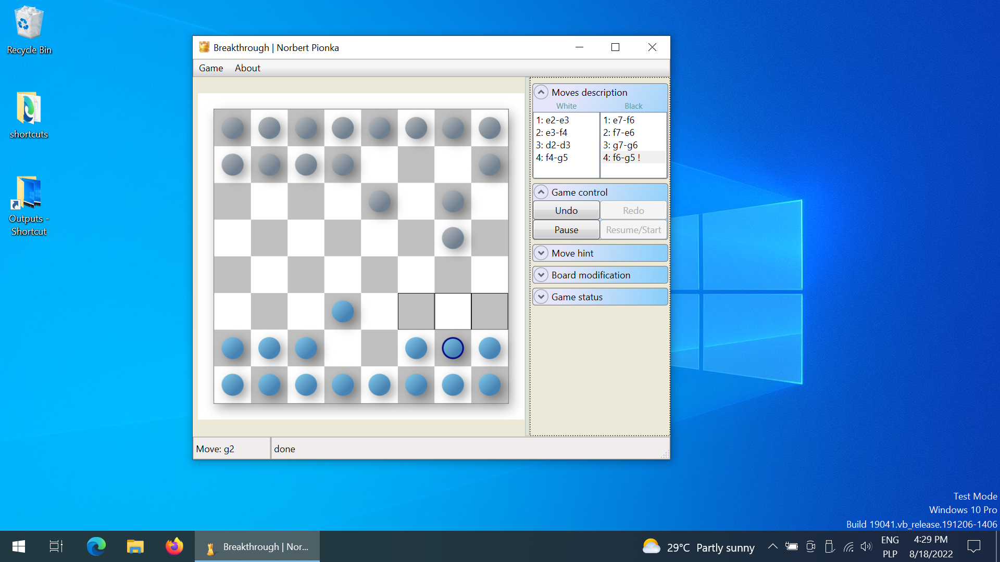

# Breakthrough
[](https://github.com/norbert-page/breakthrough/blob/main/LICENSE)

This project implements a [breakthrough](https://en.wikipedia.org/wiki/Breakthrough_(board_game)) board game as a Windows GUI application. For a quick glimpse you may want to check [videos](videos) or [screenshots](screenshots). The features include:
* Games on the same computer with other people, playing with a computer or observing games between two computer players. Computer uses a MinMax algorithm.
* Games over network with remote players. Uses P2P, serverless communication to allow for dynamic discovery of available players, both in local network and globally over the Internet (no explicit IP address sharing needed).
* Animated interface. For instance, clicking on a pawn shows moves that are available.
* Dynamic modifications to the board: addition and removal of the pawns mid-game.
* Displays full game history. Clicking on any of the entries for past moves rewinds the game to the selected point in game history.
* Loading and saving of the game state in \*.board files.
* Players can ask a computer for move suggestions. Those are presented with an animation on the board.

## Screenshot 

Additional [videos](videos) and [screenshots](screenshots) are available. Videos better visualize time-based animations.

## Technology stack
The game was written for a university assignment in 2008 and 2009. The task was to implement a [breakthrough board game](https://en.wikipedia.org/wiki/Breakthrough_(board_game)) using [Delphi](https://en.wikipedia.org/wiki/Delphi_(software)). I was quite surprised by this as the last time I had used Pascal was during primary school. To do something more exciting and progressive, I have learned and used C# and .NET Framework 3.5 technologies instead, including [Windows Presentation Foundation (WPF)](https://en.wikipedia.org/wiki/Windows_Presentation_Foundation) and [Windows Communication Foundation (WCF)](https://en.wikipedia.org/wiki/Windows_Communication_Foundation).

First, WPF makes use of DirectX which allows for smooth time-based animations. Second, WCF enabled P2P-based, serverless discovery of available players, both in the local network and on the global Internet, without the need to exchange IPs. Breakthrough is IPv6-native and to work in IPv4-only networks makes use of Teredo tunneling technology implemented by Microsoft. All these thechnologies aged quite well, although [.Net Core](https://en.wikipedia.org/wiki/.NET) (or simply .NET) seems to be a successor to .NET Framework as explained [here](https://devblogs.microsoft.com/dotnet/net-core-is-the-future-of-net/).

## Installation & configuration
Only files from the `release` directory are needed but for convenience you may want to download all files in the repository using this [link](https://github.com/norbert-page/breakthrough/archive/refs/heads/main.zip). Then start `setup.exe` located in the `release` directory to install.

Installer may ask you to allow for the installation of .Net Framework 3.5 which is required.

This application uses `App.config` file for configuration, including default MeshID and default port. Multiple instances may use the same port thanks to NetTcpPortSharing. Defaults are sufficient -- there is no need to configure this file.

### Play over network
On both Windows 10 and 11, Breakthrough requires additional configuration for network play to work. Disable firewall or allow connections for Breakthrough (firewall should ask whether to allow once you try to initiate a network game). In addition, the following Windows Services must be enabled:
- NetTcpPortSharing
- PNRPsvc (Peer Name Resolution Protocol)

*NetTcpPortSharing* and *Peer Name Resolution Protocol* can be enabled in Windows Services (start with `services.msc` in command line). Alternatively, start the command line with the administrator privileges and try the following commands (instead of `auto`, `demand` may also work):
```
sc.exe config NetTcpPortSharing start=auto
sc.exe config PNRPsvc start=auto
```

Teredo tunneling is required for P2P discovery to work if there is no IPv6 internet connection. Some additional commands that may be needed or useful:
```
netsh interface ipv6 install
netsh interface ipv6 set teredo client
netsh interface teredo set state type=enterpriseclient    // was needed on Windows 10 last time I tried, wasn't required on Windows 11
netsh interface teredo set state client
netsh interface teredo show state
netsh p2p pnrp peer set machinename publish=start autopublish=enable
netsh p2p pnrp peer show machinename
```
To verify that P2P network is working properly, initiate network discovery of players in the game in the background and use `netsh p2p pnrp cloud show list` and check if `GLOBAL` cloud is available. **Changes to system configuration may require a restart to take effect.**

Furthemore, it is recommended to start Breakthrough app with administrator privileges to avoid potential issues with permissions. To do so, one may first start a command line with administrator privileges, navigating to the appropriate directory (this can be checked by inspecting the Start Menu shortcut for the game) and then starting the Breakthrough app using the command:
```
start ./Breakthrough.appref-ms
```

#### Errors related to network games
**"Unable to access a key"** (Windows 10)
This solution worked for me ([source](https://answers.microsoft.com/en-us/windows/forum/all/unable-to-start-peer-name-resolution-protocol/2b37dc4c-2153-443c-b0d5-adda6771ceb5)):
> go to C:\ProgramData\Microsoft\Crypto\RSA and right-click on MachineKeys - Properties - Security and add Local Service to the Groups or user names.  To do so, click edit - Add - and type "local service" and hit check names, then click ok and click full control under permissions for local service, click ok.  you may get an error as it tries to set user "local service" for all keys which it can not because permissions are not allowed.


**"The service endpoint failed to listen on the URI because access was denied"**

Check [this solution](https://stackoverflow.com/questions/24576646/wcf-error-with-net-tcp-the-service-endpoint-failed-to-listen-on-the-uri-because) or its [archived copy](https://web.archive.org/web/20220818223621/https://stackoverflow.com/questions/24576646/wcf-error-with-net-tcp-the-service-endpoint-failed-to-listen-on-the-uri-because).